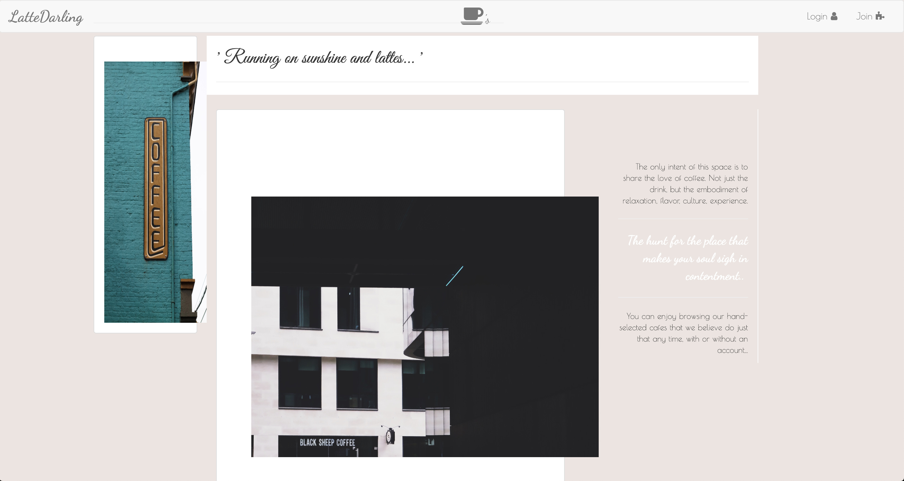
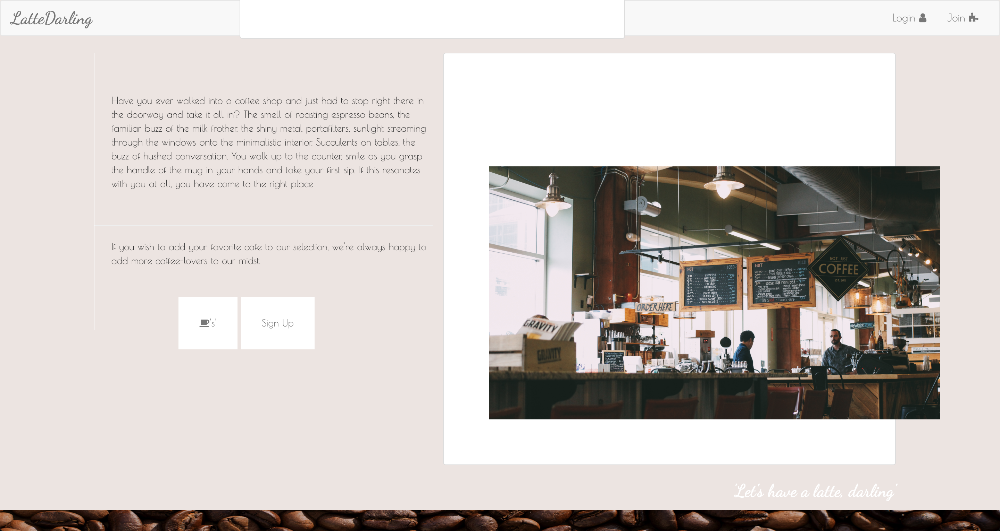
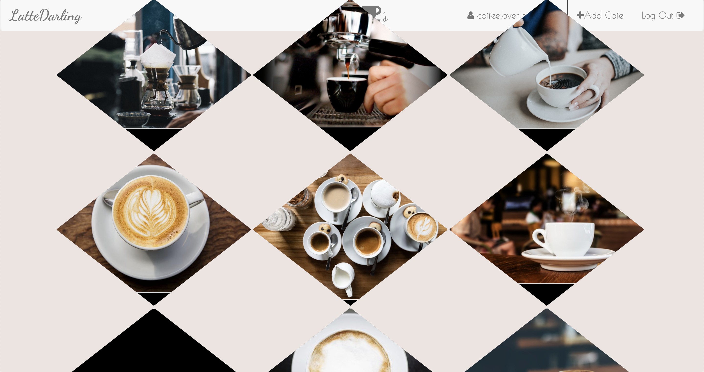
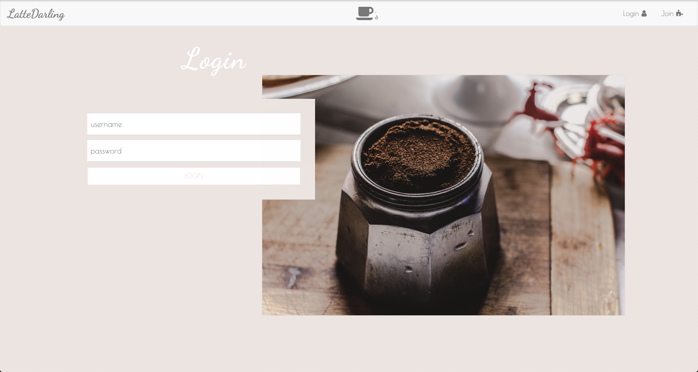

# Latte-Darling
Full-stack JavaScript social media site around the sharing and love of coffee and cafés around the world.

### Live
http://latte-darling.herokuapp.com/

### Tech Stack
- MongoDB
- HTML/CSS
- JavaScript
- Node.js
- Express
- NPM
- EJS Extension Templates
- Bootstrap
- FontAwesome Icons
- Google Fonts
- Heroku

### Features
- Custom CSS Animations
- Responsive
- Custom shapes and intearctivity
- Journey Mapping
- Authentication
- CRUD

### Mission Statement
'Let's have a latte, darling'
The only intent of this space is to share the love of coffee. Not just the drink, but the embodiment of relaxation, flavor, culture, experience.
The hunt for the place that makes your soul sigh in contentment...

#### User Statements
- I want to find cafés to visit around the world.
- I want to interact with users about my favorite coffee shops.
- I don't want to have to make an account to enjoy browsing through coffee shops.

##### Images
Below contains screenshots of final working product live

##### Author
Lisa Olson | @eunoia_lo